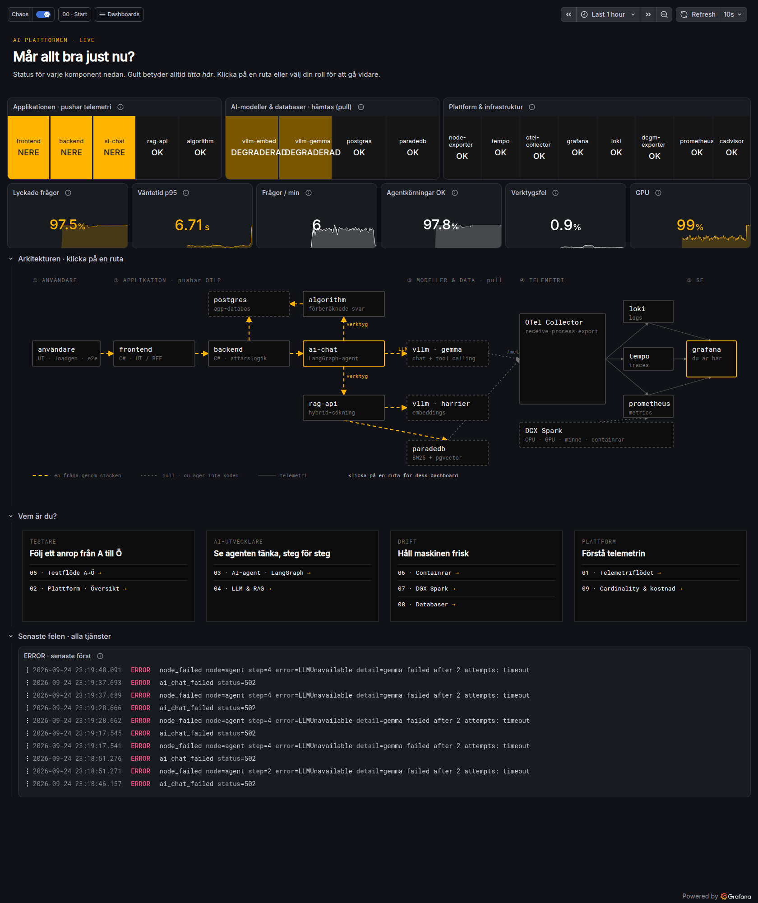
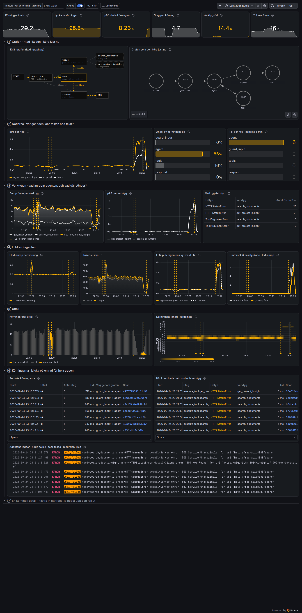
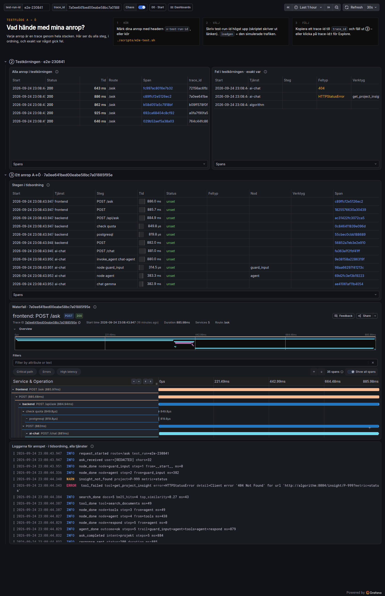
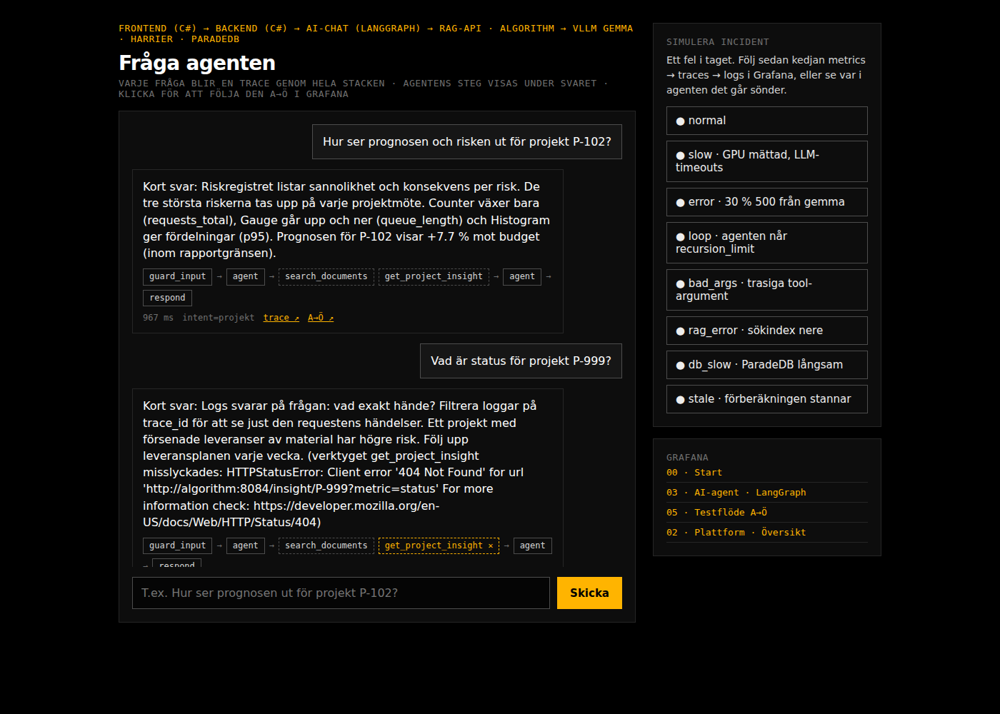

# Telemetry-demo: AI-plattform med LangGraph + OpenTelemetry → Loki · Tempo · Prometheus → Grafana

En körbar referens för hur **slutresultatet ska se ut** när många tjänster (som du inte alltid
äger) skickar telemetri till en gemensam OTel Collector, och hur det blir till *en* plattform i
Grafana som alla i teamet vill vara på: testare, AI-utvecklare, drift och plattform.

Arkitekturen speglar en typisk RAG-plattform: C#-frontend och -backend, en **LangGraph-agent**
med verktyg, en separat **rag-api** (hybrid-sökning i ParadeDB), en **algorithm**-tjänst som
förberäknar tunga resultat, och **vLLM** med en chat-modell (gemma) och en embeddings-modell
(harrier), allt på en DGX Spark.

Tjänsterna är medvetet enkla. Det är **telemetrin** som ska vara fullständig.

```bash
cd telemetry-demo
cp .env.example .env                # profiler och experiment-reglage
docker compose up -d --build        # ~20 containers, första bygget tar några minuter
open http://localhost:8080          # chatt-UI:t: agentens steg visas under varje svar
open http://localhost:3000          # Grafana, startar på 00 · Start
./scripts/e2e-test.sh               # testflöde: skriver ut en Grafana-länk per anrop
./scripts/incident.sh slow          # simulera en incident (eller knapparna i UI:t)
./scripts/incident.sh normal
```

På Windows (Git Bash) finns inte `open`: använd `start http://localhost:3000` eller öppna i webbläsaren.

**Så ser det ut** (skärmdumpar från en verifierad körning, fler i [docs/screenshots/](docs/screenshots/)):

| 00 · Start – under en incident | 03 · AI-agent – sökindexet nere |
|---|---|
|  |  |
| **05 · Testflöde A→Ö** | **Chatt-UI:t med agentens steg** |
|  |  |

---

## 1. Vad som körs

```
                    ┌──────────────────── APPLIKATIONEN (push: OTel-SDK → OTLP) ──────────────────────┐
 loadgen / e2e ──▶ frontend (C#) ──▶ backend (C#) ──▶ ai-chat (Python, LangGraph)                     │
   (användare)       UI / BFF          │ affärslogik     ├─ LLM ─────────▶ vllm-gemma (chat + tools)    │
                                       └▶ postgres       ├─ verktyg ─▶ rag-api ─▶ vllm-embed · paradedb │
                                                         └─ verktyg ─▶ algorithm (förberäknat) ─▶ postgres
                    └────────────── alla 5 skickar logs + traces + metrics ────────────────────────────┘
                                                   │ OTLP gRPC :4317
                                                   ▼
 ┌──────────── PULL ────────────┐     ┌──────────────────────────────┐
 │ vllm-gemma, vllm-embed       │◀────│      OpenTelemetry Collector │◀── externa team pushar
 │   /metrics (vllm:*)          │◀────│ receive → process → export   │    hit (:4317/:4318)
 │ postgres, paradedb (SQL-stat)│◀────│  + övervakar sig själv :8888 │
 └──────────────────────────────┘     └───────┬──────────┬───────────┘
                                         logs │   traces │   metrics
                                              ▼          ▼          ▼
 node-exporter, cAdvisor,  ◀──scrape──   Loki       Tempo ──RED──▶ Prometheus
 dcgm-exporter (GPU)                        └──────────┼──────────────┘
                                                       ▼
                                                    Grafana  (lagrar ingenting – frågar de tre)
```

| Container | Roll | Hur telemetrin kommer ut |
|---|---|---|
| `frontend` | C# ASP.NET Core, chatt-UI + BFF. Här **startar** varje trace. Sätter `test.run.id` från headern `x-test-run-id` | **Push** (OTel .NET SDK) |
| `backend` | C# affärslogik: kvotkontroll (Postgres) → ai-chat → spara konversationen | **Push** (+ Npgsql-spans) |
| `ai-chat` | **LangGraph-agent**: `guard_input → agent ⇄ tools → respond`. Verktyg: `search_documents`, `get_project_insight` | **Push**: en span per nod, LLM-anrop och verktyg ([agent_otel.py](services/ai-chat/agent_otel.py)) |
| `rag-api` | Retrieval: embeddings (harrier) → BM25 (pg_search) + vektor (pgvector) → Reciprocal Rank Fusion | **Push** (+ psycopg-spans, kvalitetsmetrics) |
| `algorithm` | Förberäknar prognos/risk/status i bakgrunden. Verktyget läser ur cachen på ms, i stället för ~1 s | **Push** (egen trace per förberäkning) |
| `vllm-gemma` / `vllm-embed` | Mockar av **vLLM** (OpenAI-API med tool calling, embeddings, `vllm:*`-metrics, simulerad GPU). Riktig vLLM med `COMPOSE_PROFILES=gpu` | **Pull** – ingen SDK, bara `/metrics` |
| `postgres` / `paradedb` | App-databasen och RAG-databasen (Postgres + pg_search + pgvector) | **Pull** – Collectorn loggar in och läser statistik |
| `loadgen` | Simulerade användare (~2 frågor/s), olika vägar genom agenten | ingen (den är "användaren") |
| `otel-collector` | Den enda ingången | tar emot, filtrerar, redigerar PII, samplar, batchar |
| `loki` / `tempo` / `prometheus` | Lagring per signal | skrapas själva av Prometheus |
| `grafana` | 10 dashboards + länkade datakällor | |
| `node-exporter` / `cadvisor` | Värd- och container-metrics | **Pull** av Prometheus |

---

## 2. Dashboards – en per fråga, en per roll

Alla ligger i mappen *Telemetry-demo*, har delad crosshair (samma tidpunkt i alla paneler) och
gula markörer när någon slår på ett chaos-läge.

| | Dashboard | För | Svarar på |
|---|---|---|---|
| 00 | **Start** | alla | Mår allt bra just nu? Status per komponent (OK/STÖRD/NERE), fem nyckeltal, klickbar arkitekturkarta, genvägar per roll |
| 01 | **Telemetriflödet** | plattform | Hur rör sig telemetrin? Vem pushar/pullar, vad Collectorn tar emot, filtrerar, samplar och skickar |
| 02 | **Plattform · Översikt** | alla | Är något fel, var, och vad exakt? RED per tjänst med exemplars, orsak bredvid verkan, service graph, loggar |
| 03 | **AI-agent · LangGraph** | AI-utvecklare | Vad gör agenten steg för steg, och var går det fel? Grafen ritad och körd, tid per nod, verktyg, LLM, varje körning |
| 04 | **LLM & RAG** | AI-utvecklare | Är det modellen, embeddings eller sökningen? vLLM per modell, sökningens steg, träffkvalitet |
| 05 | **Testflöde A→Ö** | testare | Vad hände med mina anrop? Alla anrop i en testkörning, alla fel och exakt var, varje steg i ordning |
| 06 | **Containrar** | drift | Lever allt, och vem äter maskinen? Omstarter, OOM, topp 5 CPU/minne/nät/disk |
| 07 | **DGX Spark** | drift | Har maskinen resurser kvar? CPU, unified memory, GPU, temperatur, klockstrypning |
| 08 | **Databaser** | drift | Mår databaserna, och är det de som gör appen långsam? Inifrån (receiver) och utifrån (app-spans) |
| 09 | **Cardinality & kostnad** | plattform | Vad kostar telemetrin? Serier, bytes och spans per tjänst |

### Dashboards är kod

Dashboards genereras från `observability/grafana/` – ingen JSON skrivs för hand:

```
build_dashboards.py     bygger alla, validerar, skriver dashboards/*.json   (--check i CI)
check_queries.py        kör VARJE query mot Grafana och listar paneler utan data
dashlib/                byggstenar, layout, färgspråk, validering, arkitekturkartor
boards/bNN_*.py         en fil per dashboard
```

Ändra i `boards/`, kör `python3 observability/grafana/build_dashboards.py`, och Grafana laddar om inom
30 s. Kör `python3 observability/grafana/check_queries.py` för att se att alla queries ger data.

### Tre saker att prova

**Metrics → traces → logs.** `./scripts/incident.sh slow`. På **02** stiger p95 och GPU:n går mot
100 % *innan*. Klicka på en **◆ exemplar** i p95-grafen → tracen öppnas → `chat gemma` i noden
`agent` tar tiden, med ett omförsök → **Logs for this span** visar `llm_request_retry … reason=timeout`.

**Var i agenten kraschar det?** Knappen **loop** i UI:t (eller `./scripts/incident.sh loop`). På **03**
växer kanten `tools → agent` i den levande grafen, *Lyckade körningar* går ned, och tabellen
*Senaste körningarna* visar `recursion_limit` med vägen `guard_input → agent → tools → agent → …`.
Prova `bad_args` (trasiga tool-argument: `ToolArgumentError` på verktyget) och `rag_error`
(sökindex nere: `execute_tool search_documents` blir gul, men agenten svarar ändå).

**Testflöde A→Ö.** `./scripts/e2e-test.sh` kör fem scenarier (ett med okänt projekt) med ett eget
test-run-id och skriver ut en länk per anrop. På **05** syns alla anrop, felet (`404` från
`get_project_insight`) och varje steg i tidsordning, waterfall och loggar för anropet.

---

## 3. Push vs pull – vem ansvarar för vad?

**Push (OTLP).** Tjänsten har en OpenTelemetry-SDK och *skickar själv*. Teamet som äger tjänsten
ansvarar för instrumenteringen. Du ger dem ett **kontrakt**, inte kod
([docs/kontrakt-for-team.md](docs/kontrakt-for-team.md)):

```bash
OTEL_EXPORTER_OTLP_ENDPOINT=http://<din-collector>:4317     # eller :4318 för HTTP
OTEL_SERVICE_NAME=<unikt, stabilt namn>
OTEL_RESOURCE_ATTRIBUTES=deployment.environment.name=prod,service.version=1.2.3
```

Testa kontraktet utan SDK: `./scripts/send-test-telemetry.sh` skickar en span, en loggrad och en
metric som `partner-service` med curl.

**Pull (scrape).** Produkten exponerar `/metrics` eller statistik, och **du** hämtar. Normalfallet
för vLLM, databaser och exporters. Två ställen att hämta från, demot visar båda:

| Vem hämtar | Används här för | Varför |
|---|---|---|
| **Prometheus** (`prometheus.yml`) | node-exporter, cAdvisor, dcgm-exporter, stacken själv | Klassiskt, `up`-metric per mål |
| **Collectorn** (`prometheus`/`postgresql`-receivers) | vLLM ×2, postgres, paradedb | Samma pipeline som allt annat: samma `service.name`, samma berikning |

> Alla signaler hamnar i tre lager, oavsett om de pushades eller hämtades. Grafana kopplar ihop dem
> via `service.name`, tidsaxeln och `trace_id`. Därför spelar det ingen roll för användaren vem som
> pushar och vem som pullar. Det som spelar roll är att alla följer samma namngivning.

## 4. Så instrumenteras en LangGraph-agent

[`services/ai-chat/agent_otel.py`](services/ai-chat/agent_otel.py) är ~200 rader utan beroenden utöver
OTel-SDK:t och går att lyfta in i ett riktigt projekt:

```python
tel = AgentTelemetry("chat-agent")

@tel.node("agent")                                   # span "node agent" + duration + kant från förra noden
async def agent(state, config):
    async with tel.llm_call(model, messages, TOOLS) as call:   # span "chat gemma", GenAI-semconv, tokens
        call.response(await client.post(...))

async with tel.tool_call(name, call_id, raw_args) as t:        # span "execute_tool search_documents"
    t.result(await fn(args))
```

Det ger (enligt OTel GenAI semantic conventions där de finns):

| Signal | Namn | Labels / attribut |
|---|---|---|
| spans | `invoke_agent chat-agent` → `node <namn>` → `chat gemma` / `execute_tool <verktyg>` | `langgraph.step`, `langgraph.previous`, `gen_ai.tool.call.arguments`, `gen_ai.input/output.messages`, `error.type` |
| metrics | `langgraph.node.duration`, `langgraph.transitions`, `agent.tool.calls`, `agent.runs`, `agent.run.steps` | `langgraph.node`, `langgraph.from/to`, `gen_ai.tool.name`, `outcome` – få, stabila värden |
| logs | `node_done node=agent step=2`, `tool_failed tool=… error=…`, `agent_recursion_limit` | `trace_id`, `span_id` i varje rad |

Innehåll (prompter, svar, verktygsargument) loggas när
`OTEL_INSTRUMENTATION_GENAI_CAPTURE_MESSAGE_CONTENT=true` (klipps vid 2000 tecken, e-post redigeras
i Collectorn). Stäng av med `CAPTURE_CONTENT=false` i `.env` om innehållet är känsligt.

## 5. Vad Collectorn gör (`observability/otel-collector/config.yaml`)

| Steg | Processor | I demot |
|---|---|---|
| Skydda sig själv | `memory_limiter` | backar av vid 80 % minne |
| Berika | `resource/env`, `resource/postgres`, `resource/paradedb` | miljö på allt, `service.name` på databasernas statistik |
| Rensa brus | `filter/noise` | slänger `/health`-spans, FastAPI:s ASGI-mini-spans och DEBUG-loggar |
| Ta bort PII | `transform/redact` | `user.email` på spans och e-post i loggtext → `[REDACTED]` |
| Sampla | `tail_sampling` | behåll **alla fel** och **alla > 2 s**, plus `TRACE_SAMPLING_PERCENT` av resten |
| Batcha | `batch` | färre, större skrivningar |

Collectorn exponerar sina egna metrics på `:8888` och Prometheus skrapar dem (dashboard 01).

## 6. Chaos-lägen och experiment

Ett läge i taget, från UI:t eller `./scripts/incident.sh <läge>`:

| Läge | Vad som händer | Var du ser det |
|---|---|---|
| `slow` | GPU mättad, gemma svarar på 1–4 s → timeouts och omförsök | 00 (vllm STÖRD), 02, 04 |
| `error` | 30 % av gemmas svar blir 500 → `llm_unavailable` | 03 Utfall, 02 felkvot |
| `loop` | modellen slutar aldrig anropa verktyg → `GraphRecursionError` | 03: grafen, Senaste körningarna |
| `bad_args` | hälften av tool calls får trasig JSON → `ToolArgumentError` | 03: Verktygsfel · typ |
| `rag_error` | sökindexet ger 503 i 40 % av sökningarna | 03 Här kraschade det, 04 Sökfel |
| `db_slow` | ParadeDB-frågorna tar ~1 s | 04 Tid per steg, 08 Långsamma DB-frågor |
| `stale` | förberäkningen stannar → verktyget räknar på nytt (~1 s) | 03 p95 per verktyg, algorithm-loggar |
| `story` | normal 3 min → slow 3 min → normal (som i filmen) | alla |

| Ändra i `.env` | Vad du ser |
|---|---|
| `BAD_CARDINALITY=true` + `docker compose up -d backend` | `app_ask_requests_total` får `user_id`/`request_id` som labels, dashboard 09: serierna rusar |
| `TRACE_SAMPLING_PERCENT=10` + `docker compose up -d otel-collector` | färre traces, men fel och långsamma finns kvar |
| `RPS=10` | mer last: vLLM-kö, GPU, batch-storlek |
| `AGENT_MAX_STEPS=4` | agenten når recursion limit redan vid två verktygsvarv |

## 7. På DGX Spark med riktig GPU

```bash
COMPOSE_PROFILES=gpu VLLM_CHAT_MODEL=google/gemma-3-4b-it VLLM_EMBED_MODEL=<er embeddings-modell> docker compose up -d --build
```

- `vllm-gemma-gpu` och `vllm-embed-gpu` ersätter mockarna (samma nätverksnamn, samma `/metrics`).
  vLLM **pushar dessutom egna traces** via `--otlp-traces-endpoint`.
- Tool calling kräver `--enable-auto-tool-choice` och rätt `--tool-call-parser` för modellen
  (`VLLM_TOOL_PARSER`). Kontrollera vad er Gemma-version stöder.
- `dcgm-exporter` ersätter den simulerade GPU:n. På GB10 kan vissa DCGM-fält saknas eftersom
  minnet är unified. Unified memory syns då i node-exporterns minnespanel.
- `VLLM_IMAGE` / `DCGM_IMAGE` kan behöva pekas på NVIDIA:s arm64-images för Spark (NGC).

## 8. Filer

```
docker-compose.yml               alla containers + OTel-miljövariablerna (kontraktet)
.env.example                     mall för .env (profiler och experiment-reglage)
services/frontend|backend        C#  – Program.cs visar hela OTel-setupen (~15 rader)
services/ai-chat                 LangGraph-agent: graph.py (grafen), agent_otel.py (instrumenteringen)
services/rag-api                 hybrid-sökning i ParadeDB, kvalitetsmetrics
services/algorithm               förberäkning i bakgrunden + cache
services/llm-mock                vLLM-mock (chat med tool calling / embeddings), bara /metrics
observability/otel-collector     receivers, processors, exporters
observability/prometheus|loki|tempo
observability/grafana            dashboards som kod + datakällor med länkar (exemplar→trace→logs)
scripts/e2e-test.sh              testflöde med test-run-id och länkar till Grafana
scripts/incident.sh              chaos-lägen (se §6)
scripts/send-test-telemetry.sh   "externt team" pushar med ren OTLP/HTTP
docs/kontrakt-for-team.md        vad du kräver av team som pushar
```

## Begränsningar (medvetet)

- Ingen autentisering, TLS eller HA. Collectorn tar emot från vem som helst på 4317/4318.
  I produktion: TLS, `bearertokenauth` eller mTLS, och en gateway-Collector per miljö.
- Lokal disk som lagring. I produktion: objektlagring (S3/MinIO) för Loki och Tempo.
- Browser-telemetri (RUM) saknas. Frontendens traces startar på servern. Collectorn har CORS
  påslaget för OTLP/HTTP, så en browser-SDK (eller Grafana Faro) kan pekas på `:4318`.
- cAdvisor kräver en vanlig Docker-värd (cgroup v2). I nästlade/sandlådade miljöer blir
  containerpanelerna tomma.
- Mockarna svarar deterministiskt och embeddings är hash-baserade: träffkvaliteten är låg med
  flit. Med riktiga modeller ger samma dashboards riktiga kvalitetssignaler.
